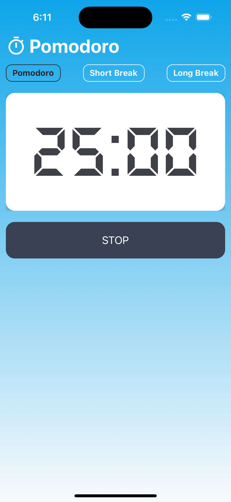

# PomodoroApp

### Indice de contenido
- [Descripción](#descripción)
- [Capturas de Pantalla](#capturas)
- [Instalación](#instalación)
- [Uso](#uso)
- [Contribución](#contribución)

### Tecnologías usadas
1. React Native
2. Expo

## Descripción
Es una aplicaón la cual utiliza el metodo pomodoro para poder estudiar o realizar alguna actividad, el cual funciona determinando un tiempo para estar concentrado y un tiempo determinado para descansar asi repitiendo este mismo proceso las veces que sea necesario.

## Capturas de Pantalla

## Instalación
Para instalar pomodoroApp, siga estos pasos:
1. Clone el repositorio: `git clone https://github.com/tuusuario/PomodoroApp.git`
2. Navegue al directorio del proyecto `cd PomodoroApp`
3. Instalar las dependencias `npm install`
4. Iniciar la aplicación `npm run ios` ó `npm run android`

## Uso
1. Abre la aplicación.
2. Escoge el temporizador adecuado.
3. Presiona "Iniciar" para comenzar una sesión Pomodoro.
4. ¡Concéntrate durante el tiempo asignado!
5. Descansa cuando suene la alerta.
6. Repite el proceso según sea necesario.

## Contribución
¡Gracias por considerar contribuir a PomodoroApp! Si deseas aportar, sigue estos pasos:
1. Haz un fork del proyecto.
2. Crea una rama para tu contribución: `git checkout -b feature/nueva-caracteristica`
3. Realiza tus cambios y haz commit: `git commit -m "Agrega nueva característica"`
4. Haz push a tu rama: `git push origin feature/nueva-caracteristica`
5. Crea una solicitud de extracción desde tu rama.
